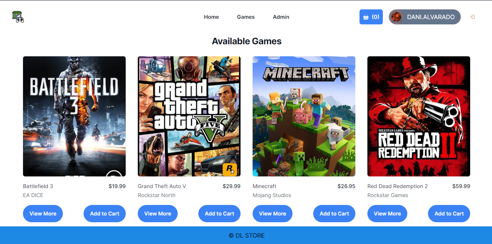

# DL-Store

## **✦ Preview de la Tienda** 🚀

---

<p align="center">
    
</p>

<br/>
<br/>

## **✦ Acerca de** ℹ

---

DL-Store es una tienda en línea de videojuegos. Con una interfaz amigable y fácil de usar, puedes explorar, seleccionar y comprar tus juegos favoritos.

### **✦ Características** 🎮

---

- **Explorar Juegos**: Navega por una amplia selección de juegos en nuestro carrusel interactivo.
- **Detalles del Juego**: Haz clic en un juego para ver más detalles y opciones de compra.
- **Carrito de Compras**: Agrega juegos a tu carrito y procede al pago de manera segura.

<br/>
<br/>

## **✦ Cómo Ejecutar** 📂

---

### Con Docker Compose

Si tienes Docker instalado, puedes ejecutar el proyecto usando Docker Compose:

1. Clona el repositorio: `git clone https://github.com/DanielDls-exe/DL-Store.git`
2. Navega a la carpeta del proyecto: `cd DL-Store`
3. Ejecuta Docker Compose: `docker-compose up`
4. Abre tu navegador y visita `http://localhost:8080` para acceder a la aplicación.

### Sin Docker (Usando Yarn)

Si prefieres no usar Docker, puedes ejecutar el proyecto con Yarn:

#### Backend

1. Navega a la carpeta del backend: `cd backend`
2. Instala las dependencias: `yarn install`
3. Ejecuta el servidor: `yarn dev`
4. El backend estará disponible en `http://localhost:3000`

#### Frontend

1. Navega a la carpeta del frontend: `cd frontend`
2. Instala las dependencias: `yarn install`
3. Ejecuta la aplicación: `yarn dev`
4. Abre tu navegador y visita `http://localhost:8080` para acceder a la aplicación.

<br/>
<br/>

## **✦ Estructura del Proyecto** 📂
```
├───📁 backend/
│ ├───📁 src/
│ │ ├───📁 lib/
│ │ ├───📁 models/
│ │ ├───📁 routes/
│ │ ├───📄 config.ts
│ │ ├───📄 main_app.ts
│ │ ├───📄 server.ts
│ │ ├───📄 seed.ts
│ ├───📁 public/
│ ├───📄 .eslintrc.json
│ ├───📄 dockerfile
│ ├───📄 package.json
│ ├───📄 tsconfig.json
├───📁 frontend/
│ ├───📁 components/
│ │ ├───📁 base/
│ │ ├───📁 cart/
│ │ ├───📁 core/
│ │ ├───📁 games/
│ ├───📁 hooks/
│ ├───📁 lib/
│ ├───📁 pages/
│ ├───📁 public/
│ ├───📁 types/
│ ├───📄 .babelrc.js
│ ├───📄 dockerfile
│ ├───📄 next.config.js
│ ├───📄 package.json
│ ├───📄 tailwind.config.js
│ ├───📄 tsconfig.json
├───📄 docker-compose.yml
└───📄 README.md
```
<br/>
<br/>


## **✦ Agradecimientos** 🙏

 - [CoreCodeSchool](https://github.com/core-school)
 - [Juan Pablo Mora](https://github.com/Systrent)
 - [Marc Pomar](https://github.com/boyander)


---

## **✦ Autor** ✒️

Este proyecto fue desarrollado por:

* **Daniel Alvarado** - [danieldls-exe](https://github.com/DanielDls-exe)
---
⌨️ con ❤️ por [danieldls-exe](https://github.com/DanielDls-exe)
